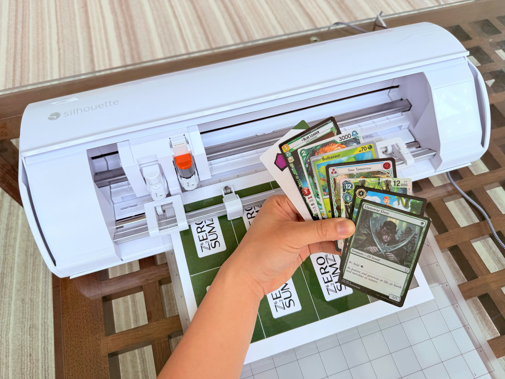

# Custom Card Games with the Cameo Cutting Machine



Ever wanted to make your own custom card game but without the hassle of a craft knife, a rotary cutter, or a paper guillotine? How about making your own proxies to playtest your favorite TCG?

You can do it all with the press of a button and a cutting machine! And I can show you how!

If this is your first time here, check out the [tutorial](https://alan-cha.github.io/silhouette-card-maker-testing/tutorial/)! Please join our [Discord server](https://discord.gg/jhsKmAgbXc) too!

## Demo

Watch me cut 104 cards in 26 minutes without breaking a sweat!

[](https://www.youtube.com/watch?v=RVHtqsRW8t8)

## Purpose

The purpose of this repo is to enable you to use a Silhouette cutting machine to create card games and proxies. Proxies are only intended to be used for casual play and playtesting.

Proxies should be easily identifiable as proxies. You may not use this repo to create counterfeit cards to decieve people or to play in sanctioned tournaments. You are only permitted to sell cards if you are the full privileged copyright holder.

## Contents

* [documentation](https://alan-cha.github.io/silhouette-card-maker-testing)
* [tutorial](https://alan-cha.github.io/silhouette-card-maker-testing/tutorial/)
* [supply list](https://alan-cha.github.io/silhouette-card-maker-testing/tutorial/supplies/)
* [create_pdf.py](#create_pdfpy), a script for laying out your cards in a PDF
* [offset_pdy.py](#offset_pdfpy), a script for adding an offset to your PDF
* [cutting_templates/](cutting_templates/), a directory containing Silhoutte Studio cutting templates
* [calibration/](calibration/), a directory containing offset calibration sheets
* [examples/](examples/), a directory containing sample games
* [plugins/](plugins/), a directory containing scripts for streamlining card image acquisition

## Supported Sizes

This project supports the following card and paper sizes, with more in the future:

| Paper size | `standard`* | `japanese`** | `poker` | `poker_half` | `bridge` | `domino` | `square_half` |
| ---------- | ----------- | ------------ | ------- | ------------ | -------- | -------- | ------------- |
| `letter`   | ✅         | ✅           | ✅     |  ✅          | ✅      | ✅       | ✅           |
| `tabloid`  | ✅         | ❌           | ❌     |  ❌          | ❌      | ❌       | ❌           |
| `a4`       | ✅         | ✅           | ✅     |  ✅          | ✅      | ❌       | ❌           |
| `a3`       | ✅         | ❌           | ❌     |  ❌          | ❌      | ❌       | ❌           |
| `archb`    | ✅         | ❌           | ❌     |  ❌          | ❌      | ❌       | ❌           |

| Paper size | Inches       | Millimeters   |
| ---------- | ------------ | ------------- |
| `letter`   | **8.5 x 11** | 215.9 x 279.4 |
| `tabloid`  | **11 x 17**  | 279.4 x 431.8 |
| `a4`       | 8.3 x 11.7   | **210 x 297** |
| `a3`       | 11.7 x 16.5  | **297 x 420** |
| `archb`    | **12 x 18**  | 304.8 x 457.2 |

| Card size     | Inches          | Millimeters   |
| ------------- | --------------- | ------------- |
| `standard`*   | 2.48 x 3.46     | **63 x 88**   |
| `japanese`**  | 2.32 x 3.39     | **59 x 86**   |
| `poker`       | **2.5 x 3.5**   | 63.5 x 88.9   |
| `poker_half`  | **1.75 x 2.45** | 44.45 x 62.23 |
| `bridge`      | **2.25 x 3.5**  | 57.15 x 88.9  |
| `domino`      | **1.75 x 3.5**  | 44.45 x 88.9  |
| `square_half` | **1.75 x 1.75** | 44.45 x 44.45 |

\* including: Magic the Gathering, Pokémon, Lorcana, One Piece, Digimon, Star Wars: Unlimited, and Flesh and Blood.

** including: Yu-Gi-Oh!.

You can find all the cutting templates for Silhouette Studio in [`cutting_templates/`](cutting_templates/).

## create_pdf.py
`create_pdf.py` is a CLI tool that layouts your card images into a PDF with registration marks that can be cut out with the appropriate cutting template in [`cutting_templates/`](cutting_templates/).


### Basic Usage

Create a Python virtual environment.
```sh
python -m venv venv
```

Activate the Python virtual environment.
**Terminal (macOS/Linux):**
```sh
. venv/bin/activate
```

**PowerShell (Windows):**
```powershell
.\venv\Scripts\Activate.ps1
```

Download Python packages.
```sh
pip install -r requirements.txt
```

Put your front images in the `game/front/` folder.

Put your back image in the `game/back/` folder.

Run the script.
```sh
python create_pdf.py
```

Get your PDF at `game/output/game.pdf`.

### Plugins

Plugins streamline the process for acquiring card images for various games.

The Magic: The Gathering plugin supports various decklist formats, including **MTGA**, **MTGO**, **Archidekt**, **Deckstats**, **Moxfield**, and **Scryfall**. To learn more, see [here](plugins/mtg/README.md).

The Yu-Gi-Oh! plugin supports **YDK** and **YDKE** formats. To learn more, see [here](plugins/yugioh/README.md).

The Lorcana plugin supports **Dreamborn** format. To learn more, see [here](plugins/lorcana/README.md).

### Double-Sided Cards

To create double-sided cards, put front images in the `game/front/` folder and back images in the `game/double_sided/` folder. The filenames must match for each pair.

### Corner Artifacts

If your card images have rounded corners, they may be missing print bleed in the PDF. Because of the missing print bleed, when the cards are cut, they may have a sliver of white on the corners.


The `--extend_corners` option can ameliorate this issue. You may need to experiment with the value but I recommend starting with `10`

```sh
python create_pdf.py --extend_corners 10
```

### CLI Options

```
Usage: create_pdf.py [OPTIONS]

Options:
  --front_dir_path TEXT           The path to the directory containing the
                                  card fronts.  [default: game/front]
  --back_dir_path TEXT            The path to the directory containing one or
                                  no card backs.  [default: game/back]
  --double_sided_dir_path TEXT    The path to the directory containing card
                                  backs for double-sided cards.  [default:
                                  game/double_sided]
  --output_path TEXT              The desired path to the output PDF.
                                  [default: game/output/game.pdf]
  --output_images                 Create images instead of a PDF.
  --card_size [standard|japanese|poker|poker_half|bridge|domino|square_half]
                                  The desired card size.  [default: standard]
  --paper_size [letter|tabloid|a4|a3|archb]
                                  The desired paper size.  [default: letter]
  --only_fronts                   Only use the card fronts, exclude the card
                                  backs.
  --crop FLOAT RANGE              Crop a percentage of the outer portion of
                                  front and double-sided images, useful for
                                  existing print bleed.  [0<=x<=100]
  --extend_corners INTEGER RANGE  Reduce artifacts produced by rounded corners
                                  in card images.  [default: 0; x>=0]
  --ppi INTEGER RANGE             Pixels per inch (PPI) when creating PDF.
                                  [default: 300; x>=0]
  --quality INTEGER RANGE         File compression. A higher value corresponds
                                  to better quality and larger file size.
                                  [default: 75; 0<=x<=100]
  --load_offset                   Apply saved offsets. See `offset_pdf.py` for
                                  more information.
  --name TEXT                     Label each page of the PDF with a name.
  --help                          Show this message and exit.
```

### Examples

Create poker-sized cards with A4 sized paper.

```sh
python create_pdf.py --card_size poker --paper_size a4
```

Crop the borders of the front and double-sided images. This option is useful if your images already have print bleed.

```sh
python create_pdf.py --crop 6.5
```

Remove the [rounded corners](#corner-artifacts) from the PDF and load the saved offset from [`offset_pdf.py`](#offset_pdfpy).

```sh
python create_pdf.py --extend_corners 10 --load_offset
```

Produce a 600 pixels per inch (PPI) file with minimal compression.

```sh
python create_pdf.py --ppi 600 --quality 100
```

## offset_pdf.py

It's pivotal to ensure that your card fronts and backs are aligned. The front and back alignment is mainly determined by your printer, but it's not always possible to calibrate it.

`offset_pdf.py` is a CLI tool that adds an offset to every other page in a PDF. This offset can compensate for the natural offset of your printer, allowing you to have good front and back alignment.

### Basic Usage

First, you must determine the offset by using the [calibration sheets](calibration/).

`<paper size>_calibration.pdf` has a front page and a back page.


The front page is a simple grid of squares.

The back page is the same grid of squares, except each square has a slight offset. The following grid illustrates the applied offsets.

```
| (-2, -2) | (-1, -2) | ( 0, -2) | ( 1, -2) | ( 2, -2) |
--------------------------------------------------------
| (-2, -1) | (-1, -1) | ( 0, -1) | ( 1, -1) | ( 2, -1) |
--------------------------------------------------------
| (-2,  0) | (-1,  0) |  Center  | ( 1,  0) | ( 2,  0) |
--------------------------------------------------------
| (-2,  1) | (-1,  1) | ( 0,  1) | ( 1,  1) | ( 2,  1) |
--------------------------------------------------------
| (-2,  2) | (-1,  2) | ( 0,  2) | ( 1,  2) | ( 2,  2) |
```

To determine the required offset, print out `<paper size>_calibration.pdf` with the card stock you plan to use.

Shine a strong light on the front so you can see the shadows on the back. Determine which set of front and back squares are aligned. This set will provide your offset.

Create and start your virtual Python environment and install Python dependencies if you have not done so already. See [here](#basic-instructions) for more information.

Run the script with your offset.
```sh
python offset_pdf.py --x_offset -5 --y_offset 10
```

Get your offset PDF at `game/output/game_offset.pdf`.

### Save Offset

You can save your x and y offset with the `--save` option. After saving your offset, it'll be automatically applied every time you run `offset_pdf.py`. You can override the loaded offset using `--x_offset` and `--y_offset`.

```sh
python offset_pdf.py --x_offset -5 --y_offset 10 --save
```

Additionally, you can automatically apply a saved offset in [`create_pdf.py`](#create_pdfpy) by using the `--load_offset` option.

```sh
python create_pdf.py --load_offset
```

### CLI Options

```
Usage: offset_pdf.py [OPTIONS]

Options:
  --pdf_path TEXT         The path of the input PDF.
  --output_pdf_path TEXT  The desired path of the offset PDF.
  -x, --x_offset INTEGER  The desired offset in the x-axis.
  -y, --y_offset INTEGER  The desired offset in the y-axis.
  -s, --save              Save the x and y offset values.
  --ppi INTEGER RANGE     Pixels per inch (PPI) when creating PDF.  [default:
                          300; x>=0]
  --help                  Show this message and exit.
```